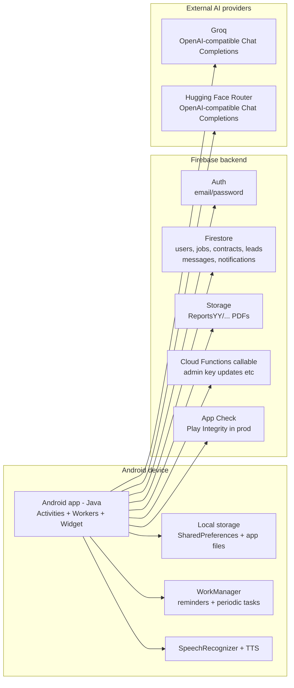

# PestControlOS (PCOS) – Field Operations Platform

This repository contains the **PestControlOS** field operations application for pest control businesses. It is built in **Java** for Android and backed by **Firebase** (Authentication, Firestore, Storage), with optional Cloud Functions and LLM integrations. The app streamlines scheduling, contracts, jobs, reports, messaging, leads, and notifications with role-based access for **administrators** and **technicians**.

This document is the main reference for developers, maintainers, and power users. It describes the **Main Activity** (every button and destination), **Admin vs Technician** behaviour, setup, and security. For architecture and sequence diagrams, see **[ARCHITECTURE.md](ARCHITECTURE.md)**.

---

## Architecture overview

The app runs on the device and communicates with Firebase (Auth, Firestore, Storage, optional Cloud Functions, App Check) and optional external AI providers (e.g. Groq, Hugging Face).


*Component diagram (PNG in repo root). Mermaid source: [docs/component_diagram.mmd](docs/component_diagram.mmd).*



---

## Main Activity – Buttons and destinations

The **Main Activity** is the home screen after login. Visibility of buttons depends on **role** (admin / super_admin / tech) and **permission flags** on the user document in Firestore. The screen is scrollable; the logout button is fixed at the bottom.

### Button reference

| Button | Opens | What you can do | Who sees it |
|--------|--------|------------------|-------------|
| **Notifications** | `NotificationsActivity` | View in-app notification history; mark as read; open linked screen (Work View, Contracts, Jobs, Messaging, etc.). | All authenticated users (hidden in offline mode). |
| **Search** | `SearchActivity` | Global search across jobs, contracts, leads, and reports; open result in the correct activity. | Users with `canSearch` (default: super_admin). |
| **Dashboard** | `AdminDashboardActivity` | Contracts summary, users summary, bug/feature reports, reports folders, storage metrics. See [Admin Dashboard](#admin-dashboard) below. | **Admin** and **super_admin** only. |
| **Employee** | `EmployeeManagementActivity` | List users; add/edit employees; change roles and permissions. | **Super_admin** only. |
| **Create Report** | `ReportSelectionActivity` | Hub for all report types. See [Create Report hub](#create-report-hub) below. | All users (offline: limited). |
| **View Reports** | `PDFSelectionActivity` | Pick year, then list PDFs in Firebase Storage (or local for offline). Open, share, or delete stored reports. | All users. |
| **Work View** | `WorkViewActivity` | Daily calendar (08:00–17:30); add/edit/move jobs, contract visits, follow-ups; see reminders; admins see all technicians’ schedules. | All users (hidden in offline). |
| **Location Finder** | `LocationFinderActivity` | View last known locations of staff (refreshed periodically by devices). | Users with `canUseLocationFinder` (default: super_admin). |
| **Contracts** | `ContractsActivity` | List contracts (Behind / Due / Up-to-date); open contract → view details, open in Maps, mark visit done, create report, assign (admin). | All users with contract access (hidden in offline). |
| **Commission** | `LeadsSelectionActivity` | Generate lead or view leads; commission and invoice tracking; mark paid (admin). | Users with `canAccessCommissionLeads`. |
| **Job Work** | `JobsActivity` | List jobs; add job and assign technician (admin); accept, complete, add follow-up (tech). Management jobs section for admin. | All users (hidden in offline). |
| **Messaging** | `MessagingConversationsActivity` | List conversations (direct + group); open chat; send/receive messages. | Users with `canMessage`. |
| **Maps** | (placeholder) | Toast: “Feature coming soon.” | Users with `canMap`. |
| **Visit …** (website) | Browser | Opens company URL (e.g. staff portal). Configurable; hidden if `show_grpcstaff_portal` is false. | All (or configurable). Offline: label may change to “Get update”. |
| **How to Use App** | `HelpReadmeActivity` | In-app help / README content. | All users (hidden in offline/demo expired). |
| **Logout** | `LoginActivity` | Clears session, caches, workers; signs out of Firebase; returns to login. Offline: button may show “Exit”. | All users. |

**Hidden on Main (moved under Create Report):** General Quotes, Service agreement, ERA, and AI Chat are not shown on the main screen in the current build; quotations, service agreements, and ERA are available from **Create Report** → Report Selection.

---

## Create Report hub (Report Selection)

Tapping **Create Report** opens **Report Selection**, which offers:

| Option | Opens | Description |
|--------|--------|-------------|
| **Service Report** | `ReportActivity` | Pest control service report (rodent initial/routine/call-out/external, etc.); PDF with logo, optional password and signatures. |
| **General Report** | `GeneralReportActivity` | Generic multi-section report; PDF generation. |
| **Action Form** | `ActionFormActivity` | Action form PDF. |
| **Contract Quotations** | `QuotesActivity` | 4/6/8/12pt and custom quote options; VAT and totals. |
| **Bird Quote** | `BirdQuotationActivity` | Bird control quotation; optional deposit. |
| **Custom Quote** (string) | `GeneralQuotationActivity` | Multi-line custom quotation. |
| **General Quotation** (catalog) | `GeneralQuotationFromCatalogActivity` | Catalog-driven quotation (e.g. sales.json). |
| **Service Agreements** | `ServiceAgreementActivity` | Service agreement with signature fields; save as PDF. |
| **ERA** | `EnvironmentSelectionActivity` | Toxic or Non-Toxic Environmental Risk Assessment; then respective ERA activity and PDF. |
| **Custom Template** | `PdfTemplateSettingsActivity` | Configure logo, watermark, header blocks for “My Template”. |
| **Create Custom Report** | `ReportActivity` (with `USE_MY_TEMPLATE`) | Generate report using the custom template. |

---

## Admin Dashboard

**Dashboard** is visible only to **admin** and **super_admin**. It opens **Admin Dashboard**, which contains:

| Block | Content | Who |
|--------|--------|-----|
| **Contracts summary** | Per-user contract counts; total contracts. Scrollable. | Admin / super_admin |
| **Users summary** | List of users; tap to change role. Scrollable. | Admin / super_admin |
| **Bug report / Feature request** | **Submit** → submit bug or feature request. **View** → list and (super_admin) set cost, days, status, mark complete, delete; long-press to edit; feature quotes and client agree/disagree. | Shown when `canBugReport`; submit/view for admin; full management for super_admin |
| **Reports folders** | **Create Reports folder** → choose year and create `ReportsYY` in Firebase Storage. | Admin / super_admin |
| **Upload / Download metrics** | Storage metrics (if configured). | Super_admin (often hidden in UI) |
| **Reports (Storage)** | Report file count and size in Storage. | Super_admin (often hidden) |
| **Auth / Sign-in summary** | Auth log (if configured). | Often hidden |

---

## Admin vs Technician – Summary

| Capability | Technician (tech) | Admin | Super_admin |
|------------|-------------------|--------|-------------|
| Notifications | Yes | Yes | Yes |
| Create Report / View Reports | Yes | Yes | Yes |
| Work View (own schedule) | Yes | Yes | Yes |
| Contracts (own by default) | Yes (own collection) | Yes (can view all / assign) | Yes |
| Job Work (own jobs) | Yes (accept, complete) | Yes (assign, view all) | Yes |
| Commission / Leads | Only if `canAccessCommissionLeads` | Typically yes | Yes |
| Messaging | Only if `canMessage` | Only if set | Often set |
| Search (global) | Only if `canSearch` | Only if set (default off) | Default on |
| Dashboard | No | Yes | Yes |
| Employee management | No | No | Yes |
| Location Finder | No | Only if `canUseLocationFinder` | Default on |
| Assign contracts/jobs | No | Yes | Yes |
| View all technicians’ Work View | No | Yes | Yes |
| Bug/feature submit & view | Only if `canBugReport` | Yes | Yes |
| Bug/feature set cost, complete, delete | No | View only | Full (incl. long-press edit, feature quotes) |
| Delete jobs/contracts | No (prompt to contact admin) | Yes | Yes |
| AI API keys (e.g. Settings) | No | No | Yes |

Role is stored in Firestore `users/{uid}` and normalised to `super_admin`, `admin`, or `tech`. Optional flags (e.g. `canSearch`, `canMessage`, `canUseLocationFinder`, `canAccessCommissionLeads`, `canBugReport`) override defaults per role.

---

## Roles and user model (Firestore)

User identity and permissions are defined in Firestore `users/{authUid}` (or equivalent user document keyed by auth UID):

| Field | Description |
|-------|-------------|
| **StaffID / authUid** | Used as document key; also for notifications and lookups. |
| **Role** | Normalised to `super_admin`, `admin`, or `tech`. Drives RBAC. |
| **Name / Email / Number** | Display and contact info; used on quotations and agreements. |
| **ContractKey** | Stable key for per-technician contract collections (`"{ContractKey} Contracts"`) and for spinners, messaging, assignments. |
| **Can flags** | Optional booleans: `canSearch`, `canUseLocationFinder`, `canMessage`, `canMap`, `canAccessCommissionLeads`, `canBugReport`, etc. |

On login, the app loads the user document and populates **SessionManager** with role and permissions. ContractKey is the internal identifier for assignments and collections; display names come from Firestore.

---

## Key capabilities (overview)

- **Authentication:** Firebase email/password; optional offline user (Create Report, View Reports, exit only).
- **Work View:** Daily calendar, slots 08:00–17:30; jobs, contract visits, follow-ups; drag-and-drop; custom times; WorkManager reminders; home-screen widget.
- **Contracts:** Per-technician collections; Behind/Due/Up-to-date; Maps, mark done, create report; admin assign; year-based report browsing in Storage.
- **Jobs:** Add and assign (admin); accept, complete, follow-ups (tech); management jobs for admin; in-app notifications on assignment.
- **Reports:** Service, general, action form, quotations (contract, bird, custom, catalog), service agreements, ERA; iText PDFs; optional password and signatures; offline “My Template”.
- **Leads/Commission:** Lead capture; commission and invoice tracking; admin can mark paid; notifications on updates.
- **Messaging:** 1:1 and group chat in Firestore; in-app only (no FCM); deep links from notifications.
- **Location:** Admin/super_admin can view staff last location (periodic updates; optional).
- **Bug/Feature requests:** Admins with `canBugReport` can submit and view; super_admin sets cost/days, status, feature quotes, client agree/disagree, and long-press edit.
- **AI:** Optional AI chat and “AI Fix” in reports; keys in Firestore (e.g. AI-Chat/AI-API); super_admin can update.

---

## How to use (by role)

- **Technician:** Use **Work View** for schedule; **Job Work** to accept and complete jobs; **Contracts** for visits and reports; **Create Report** / **View Reports** for PDFs; **Notifications** and **Messaging** (if enabled). Cannot delete jobs/contracts or access Dashboard/Employee/Location Finder unless permitted.
- **Admin:** Same as technician plus **Dashboard**, **Search** (if enabled), assignment of contracts and jobs, view all technicians’ Work View, and full contract/job management.
- **Super_admin:** Same as admin plus **Employee** management, **Location Finder** (if enabled), full bug/feature workflow, and AI key management.

---

## Technology stack

| Layer | Details |
|-------|--------|
| Client | Android (Java), XML layouts, RecyclerView, WorkManager, Material components. |
| Data & Auth | Firebase Authentication, Firestore, Firebase Storage. |
| PDF | iText; compression and optional owner-password encryption. |
| Automation | Optional Node.js Cloud Functions (e.g. message retention). |
| AI | Optional Groq / Hugging Face via HTTP; keys in Firestore. |

---

## Repository layout

```
grpc/
├── app/                    # Android app module
├── docs/                   # Architecture diagram source (Mermaid)
├── functions/              # Optional Firebase Cloud Functions
├── firestore.rules         # Firestore security rules
├── gradle.properties.template
├── build-with-env scripts   # Build helpers (Windows & *nix)
└── .gitignore
```

Demo flavour uses a separate Firebase project and package; do not use for production.

---

## Setup (summary)

1. **Prerequisites:** Android Studio, JDK, Firebase project with Firestore and Storage enabled.
2. **Package / Application ID:** Refactor package if needed; register in Firebase and place `google-services.json` in the correct module root.
3. **Firebase:** Enable Firestore and Storage; create Storage folders (e.g. `Reports25/`, `Reports26/`) and contract collections as required.
4. **Firestore rules:** Harden for production; restrict read/write by role and collection (see `firestore.rules`). Never use `allow read, write: if true` in production.
5. **Environment:** Use `gradle.properties.template` to create `gradle.properties`; optional `setup-env` and `build-with-env` scripts.
6. **Cloud Functions:** Optional; `cd functions && npm install && firebase deploy --only functions`.

---

## Security and hygiene

- Do **not** commit `google-services.json`, service account keys, API keys, or keystores; use `.gitignore` and secure storage.
- **Firestore rules:** Restrict by `request.auth.uid` and role; technicians only their own data; admins only where needed.
- **API keys:** Store LLM keys in Firestore (e.g. AI-Chat/AI-API); restrict write to super_admin; never in code or config.
- **Local data:** Offline reports and caches are not encrypted; consider EncryptedFile / SQLCipher for sensitive data.
- **TLS:** Use HTTPS for all APIs; Android defaults for Firebase.
- **Auth:** Strong passwords; consider MFA for admin accounts.
- **Input:** Validate and sanitise user input; normalise file names to avoid path traversal.
- **Logs:** Do not log sensitive data in production; use ProGuard/R8.
- **Credentials:** Rotate API keys and service accounts periodically.

---

## Troubleshooting

| Issue | Check |
|-------|--------|
| Contracts “Access Denied” | Firestore rules for `{ContractKey} Contracts`; collection exists; user has correct ContractKey. |
| No reports found | Storage folders for selected year (e.g. Reports25); PDF names match contract naming; offline: local storage. |
| Notifications not appearing | User logged in; Firestore writes to `notifications/{staffId}/items` succeed; in-app only (no FCM). |
| Wrong or duplicate names in spinners | Firestore `users` documents have correct ContractKey and Name; clear app data or re-login to refresh caches. |

---

## Support

For issues or questions, contact the maintainer or open an issue in the repository. Provide device logs (with sensitive data removed) and steps to reproduce.

The staff CRM/portal that shares this Firebase backend is hosted at [https://pestcontrolos.ie](https://pestcontrolos.ie) (and [https://www.pestcontrolos.ie](https://www.pestcontrolos.ie)).
