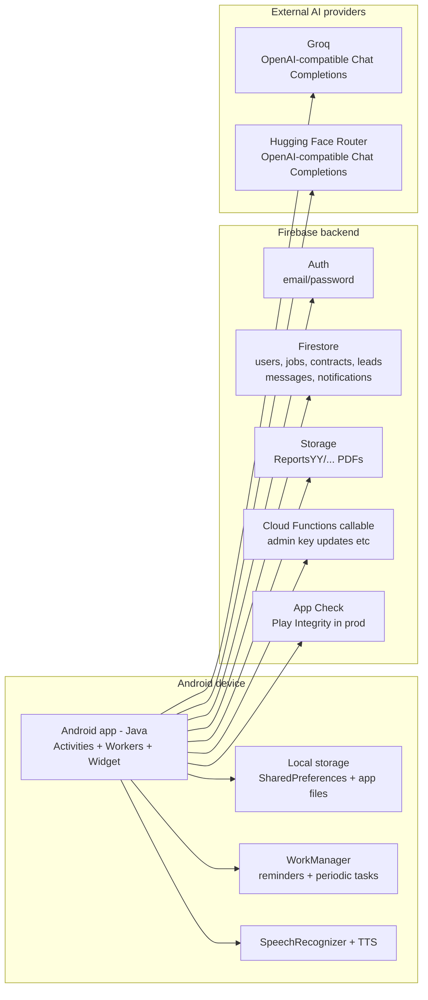
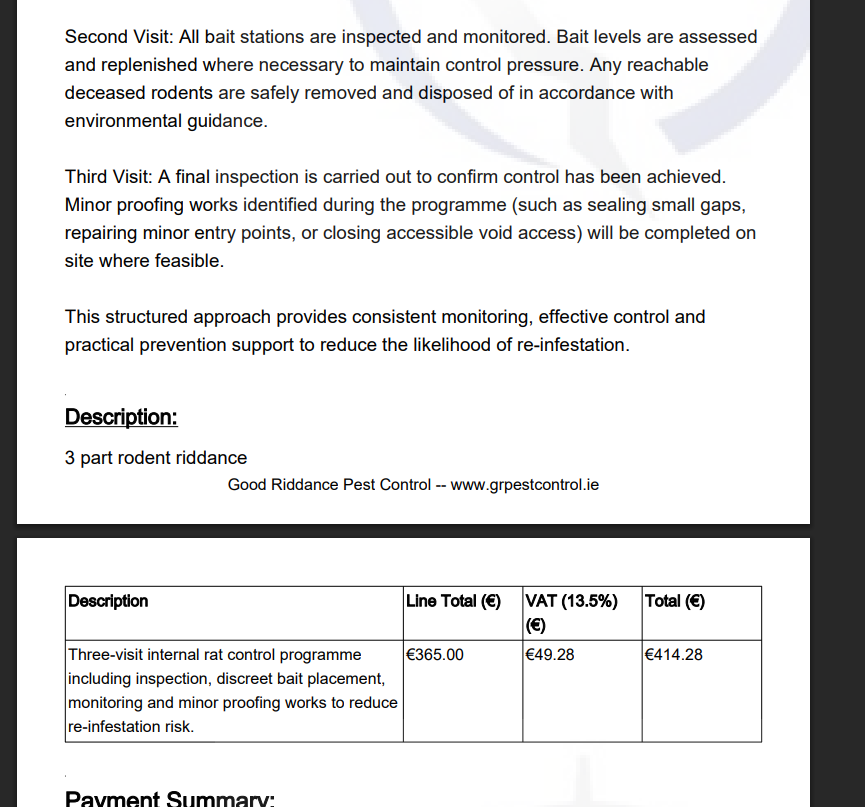
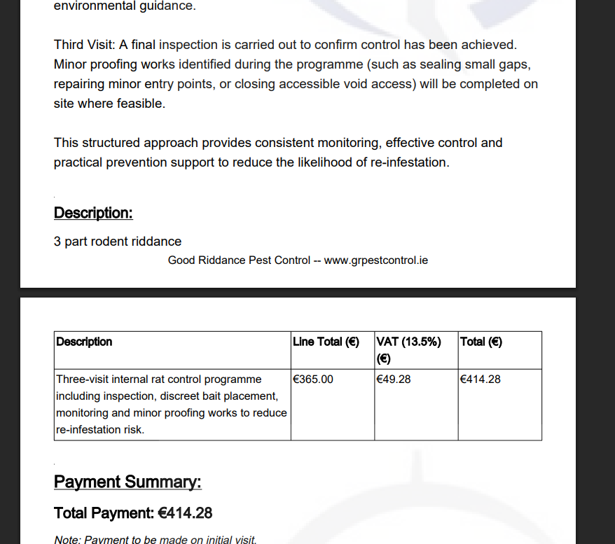
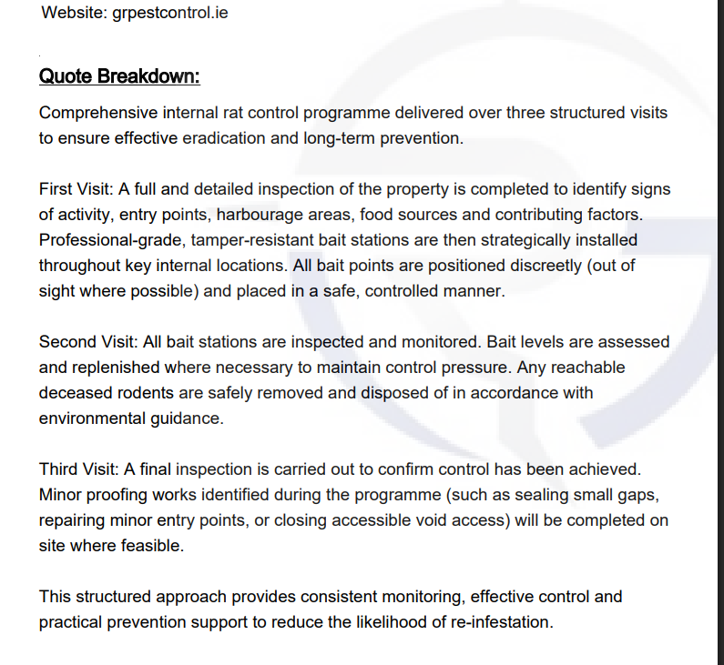

# GRPC (GRPest Control) – Field Operations Platform

This repository contains a full‑featured **field operations app** for the GRPest Control company. It is built in **Java** for Android and backed by **Firebase** (Authentication, Firestore, Storage) with optional **Cloud Functions** and **LLM APIs**. The primary goal is to streamline field work such as scheduling, contracts, jobs, reports, messaging and leads while giving admins and technicians tailored tools and in‑app notifications.

This document replaces the original README and is intended to be read by developers, maintainers and power users. It covers **every major feature**, explains the **user model**, summarises how to set up and operate the app, and highlights the **security considerations** you should be aware of. For a technical overview of the platform architecture, see **[ARCHITECTURE.md](ARCHITECTURE.md)**.

---

## Architecture overview

The app runs on the device and talks to Firebase (Auth, Firestore, Storage, optional Cloud Functions, App Check) and to external AI providers (Groq, Hugging Face). The diagram below summarises the main components.


*Component diagram (PNG in repo root). Mermaid source: [docs/component_diagram.mmd](docs/component_diagram.mmd).*

The same diagram in Mermaid (renders on GitHub/GitLab and in many Markdown viewers):



For sequence diagrams (login, report generation, AI chat) and more detail, see **[ARCHITECTURE.md](ARCHITECTURE.md)** and [docs/README.md](docs/README.md).

---

## Key Capabilities

The GRPC app is designed to handle everything a pest‑control operation needs in the field. Below is a high‑level summary of the core modules. Individual activities are described in the architecture document.

### Authentication and Offline Mode

- **Firebase Authentication** — users sign in with email/password. On successful login the session is managed by a central `SessionManager` which loads the user’s staff profile, role and permissions from Firestore.
- **Offline login** — from the login screen you can enter “Offline User” mode. In this mode no Firebase services are used and only a limited set of features are available (create reports, view reports and logout). Offline users cannot upload reports to Firebase or access notifications, jobs, contracts, leads or messaging.
- **Role‑aware UI** — all screens respect the logged‑in user’s role. Admins can assign work, view multiple calendars and edit contracts/jobs. Technicians can perform work and generate reports but cannot delete jobs or contracts. See **Roles and user model** for details.

### Scheduling (Work View)

- **Calendar view** — a daily schedule shows fixed half‑hour slots from 08:00–17:30. Technicians can tap a slot to add a job, contract visit or follow‑up.
- **Event types and colours** — jobs, contracts and follow‑ups are differentiated by colour and labelled clearly.
- **Custom times and durations** — when creating or editing an event you can specify a custom start and end (e.g. 08:30–15:00). Editing preserves the existing duration unless both start and end are changed.
- **Drag‑and‑drop** — long‑press an event in the daily view and drag it to another slot to move it. The start time snaps to the new slot and the duration stays the same.
- **Combined calendars** — admins can view other technicians’ schedules (all technicians appear on one calendar). This is useful for dispatch and office coordination.
- **Work reminders** — the app does not use Android/FCM push notifications. Instead a `WorkManager` schedules in‑app reminders about 30 minutes before an event. Reminders are cancelled if the event is completed or rescheduled, preventing duplicate alerts.
- **Home‑screen widget** — a simple widget displays today’s date and the next three jobs. Data is cached locally when Work View is opened so the widget works even after logout. See `app/src/main/assets/WIDGET_TROUBLESHOOTING.md` for help.

### Contracts

- **Technician‑scoped collections** — contracts are stored in Firestore collections named `"{ContractKey} Contracts"`, where `ContractKey` comes from `users/{StaffID}.ContractKey`. This design keeps documents stable even if login usernames change.
- **Search and status counters** — quickly filter contracts as “Behind”, “Due” or “Up‑to‑date” to prioritise your visits.
- **Actions** — open the customer address in Google Maps, update a visit as done, or create a report directly from a contract entry. Admin users can assign a contract to another technician (which triggers an in‑app notification to the assigned user).
- **Year‑based report browsing** — contract reports are stored under `ReportsYY/` in Firebase Storage. When viewing reports the user selects the year, and the app lists matching PDFs (ignoring case/spaces/underscores). Offline users can browse local reports only.

### Jobs and Follow‑ups

- **Job creation and assignment** — new service jobs can be added via the Jobs screen or directly from the calendar. Admins choose the technician from a dropdown; the assigned technician receives an in‑app notification.
- **Job lifecycle** — technicians can accept jobs, view customer details, update progress and schedule follow‑ups. Completion prompts update the calendar and remove future reminders.
- **Follow‑ups** — dedicated screens let you schedule and complete follow‑ups. These appear alongside other events in Work View.
- **Management jobs** — a separate “Management Jobs” section tracks office/administrative tasks. Admins can create and complete these jobs independently of technician work.

### Reports and Action Forms (PDF)

- **Flexible PDF generation** — the app uses iText to generate PDFs. Users can choose from several built‑in templates: service reports (rodent initial, routine, call‑out, external), general reports (4pt/6pt/8pt/12pt), action forms, quotations (general and bird), and service agreements. Reports always include the business logo and compress automatically to reduce file size.
- **Password protection** — a “Password protect PDF” checkbox encrypts the PDF with an owner password, allowing viewing/printing but requiring the password for editing.
- **Signatures and images** — technicians and customers can capture signatures via a dedicated screen. Images can be attached and embedded in the PDF if present.
- **Offline templates (“My Template”)** — when logged out, users can build custom headers with their own logo, header text, watermark and header blocks. Named templates are stored locally (`pdf_template/` via SharedPreferences) and can be selected later. Logged‑in users always use the default GRPC template for consistency.

### Quotations and Service Documents

- **General quotations** — generate quotes based on 4, 6, 8 or 12 line items with VAT and totals. Users enter line items and the app calculates totals automatically.
- **Bird quotations** — tailor quotes for bird control jobs with an optional 30 % deposit. Company contact information (email and mobile) is pulled from the staff profile, not typed manually.
- **Service agreements** — create service contracts with signature fields and save them as PDFs. These can be uploaded to Firebase Storage or kept locally.

### Leads and Commission

- **Lead capture** — record potential customer leads in `Leads`. Each lead tracks commission values, invoice numbers, payment status and materials cost.
- **Role‑based editing** — admins can mark invoices as paid and update materials cost. Technicians can add and view leads assigned to them but cannot mark invoices paid or edit materials.
- **Notifications** — edits to leads can trigger an in‑app notification to the responsible technician, maintaining an audit trail.

### Messaging and Notifications

- **1:1 and group chat** — conversations are stored in Firestore with conversation IDs derived from participant ContractKeys (e.g. direct chats and a shared `group` channel). Messages can be marked urgent; non‑urgent messages expire automatically via Cloud Functions (optional).
- **In‑app notifications** — the app has its own notification inbox per staff member (`notifications/{StaffID}/items`). Important actions like job assignment, contract assignment and lead updates fan out to admins for oversight. There are no system/FCM notifications or status‑bar alerts — everything stays inside the app.
- **Unread indicators** — the home screen shows unread counts for notifications and messages. Users can clear or delete notifications individually.
- **Deep linking** — tapping a notification opens the relevant screen (Work View, Contracts, Jobs, Messaging) with context about the event.

### Location Sharing (admin only)

- **Periodic updates** — when location permissions are granted, each device publishes its last known GPS position to Firestore every 15 minutes via `LastLocationUpdateWorker`. A companion cleanup worker deletes stale locations after 30 minutes.
- **Offline cache** — the last known location is cached locally in SharedPreferences so admins can view it offline when needed.
- **Access control** — only users with admin/oversight role have a UI to view staff locations. Firestore rules should restrict reads to authorised admins.

### Global Search (admin only)

- A dedicated search screen lets authorised admins search across jobs, contracts, leads and reports from a single interface. Results show the entity type and link to the appropriate activity. This feature is limited to admin accounts because it touches multiple collections.

### Environment Risk Assessment (ERA)

- Field technicians can perform **Toxic** or **Non‑Toxic ERA** assessments. An `EnvironmentSelectionActivity` collects the user’s name and launches either `ToxicERAActivity` or `NonToxERAActivity`. Each activity guides the technician through the respective risk‑assessment checklist and generates a PDF when complete.

### AI Features (Chat & AI Fix)

- **In‑app AI chat** — an assistant chat uses either the Groq API or the Hugging Face API depending on which key is set. A super admin updates the API keys in `AI-Chat/AI-API` in Firestore (fields `KEY` and `key-grog`). Replies are plain text (no markdown) and support long messages.
- **AI Fix** — in Create Report and Action Form screens a ✏️ AI Fix button appears for logged‑in users. Users choose which fields to polish (site inspection, recommendations, service report, etc.) and the selected text is rewritten to be professional and free of filler. Offline users do not see this button.

---

## Roles and User Model

User identity and permissions are controlled via Firestore:

| Field                 | Description                                                                                                                                 |
| --------------------- | ------------------------------------------------------------------------------------------------------------------------------------------- |
| **StaffID**           | Human‑readable ID (001, 002, 003, 004, etc.). Used as the document key in `users/{StaffID}`.                                                |
| **Role**              | Normalised to `super_admin`, `admin`, or `tech` from Firestore. Drives RBAC; no hardcoded staff IDs in app logic.                           |
| **Name/Email/Number** | Loaded into the app for display and used on quotations and service agreements.                                                              |
| **ContractKey**       | Stable key used to name per‑technician contract collections (`"{ContractKey} Contracts"`) and for spinners, messaging and assignments.      |
| **Can* flags**        | Optional boolean flags for fine‑grained permissions (e.g. create reports, manage leads).                                                  |

On login, the app resolves **UID → StaffID** (via `users/{uid}` or email match), then loads **users/{StaffID}** and populates `SessionManager` with Role, ContractKey and permissions. ContractKey is the internal identifier for assignments and collections; display names come from Firestore for UI only.

Typical assignments (your Firestore data may differ):

- **super_admin** — full access to all features, including global search, location sharing and API key management.
- **admin** — can assign work, manage contracts and jobs, update commissions, and view multiple calendars. They also receive oversight notifications.
- **tech** — can view their own work, create and upload reports, and manage their own contracts. They cannot delete jobs or contracts and have limited edit rights in leads/commission.

The offline user does not correspond to a Firestore profile. The app restricts the UI and stores data locally only.

---

## How to Use the App (By Role)

### Admin / Oversight

1. **Assign jobs** via Jobs → Add Job. Pick the technician from the dropdown. A notification is written to both the technician and to admin inboxes.
2. **Assign contracts** via Contracts → Add Contract. Select the assignee. A notification is triggered.
3. **Manage schedules** in Work View. Admins can open any technician’s calendar, drag events, set custom times and mark visits done. Reminders for technicians are scheduled automatically.
4. **View notifications and messages** to stay informed. The Notifications screen lists all events relevant to your team.
5. **Manage leads/commission** via Generate Lead / View Leads. Mark invoices as paid and update materials cost.

### Admin / Owner (super_admin)

In addition to the above, the owner (super_admin role) can:

1. **Perform global searches** across jobs, contracts, leads and reports.
2. **View staff locations** via the Location Finder.
3. **Update AI API keys** in Settings (fields `KEY` and `key-grog` under `AI-Chat/AI-API`).

### Technician

1. **Check Work View daily** to see scheduled jobs, contract visits and follow‑ups. Tap events for details, open addresses in Maps and mark work complete.
2. **Use Jobs** to review jobs assigned to you. Accept jobs, add addresses where missing and create reports.
3. **Manage contracts** assigned to you. You can add contracts to your own list, search for contract reports by year and mark visits done.
4. **Generate reports and action forms.** Fill out the forms, optionally set a password and upload the resulting PDF. If working offline, save the PDF locally and upload it later from the Stored Reports screen.
5. **Send and receive messages** via the chat screens. Use the group chat for general communication and direct chats for 1:1 conversations.

Technicians do **not** have the ability to delete jobs or contracts. The app will prompt them to contact an administrator if they attempt to do so.

---

## Technology Stack

| Layer              | Details                                                                                                                          |
| ------------------ | -------------------------------------------------------------------------------------------------------------------------------- |
| **Client**         | Android (Java), XML layouts, RecyclerView, WorkManager, Material components.                                                     |
| **Data & Auth**    | Firebase Authentication, Firestore for data, Firebase Storage for PDFs and attachments.                                           |
| **PDF generation** | [iText](https://itextpdf.com/) for all report types, with automatic compression and optional owner‑password encryption.         |
| **Automation**     | Optional Node.js Cloud Functions for scheduled cleanup (e.g. message retention) and other tasks.                                 |
| **AI Integration** | External LLM providers (Groq or Hugging Face) accessed via HTTP calls. API keys are stored in Firestore and updated via the app. |

---

## Repository Layout

```
grpc/
├── app/                         # Android app module (production)
├── docs/                        # Architecture diagram source (Mermaid)
├── functions/                   # Firebase Cloud Functions (optional automation)
├── src/demo/                    # Demo flavour (separate Firebase project)
├── gradle.properties.template   # Template for environment configuration
├── build-with-env scripts       # Helpers to build with different envs (Windows & *nix)
└── .gitignore                   # Prevents committing secrets and build artifacts
```

The **demo** flavour uses its own `google-services.json` and package name (`com.grpc.grpc.demo`) for demonstration purposes. Do not use the demo configuration for production.

---

## Setup (End‑to‑End)

### 1. Prerequisites

- Android Studio (latest stable)
- JDK (bundled with Android Studio)
- A Firebase project with Firestore and Storage enabled
- [Firebase CLI](https://firebase.google.com/docs/cli) if you intend to deploy functions

### 2. Package Name / Application ID

If you need to change the package from `com.grpc.grpc` to something else:

1. In Android Studio, use **Refactor → Rename** on the Java package. Update the `applicationId` in `app/build.gradle.kts` and rebuild.
2. Register the new package in Firebase Console and download a fresh `google-services.json`. Place it in the appropriate module’s root (e.g. `app/` or the demo flavour folder).

### 3. Firebase Setup

1. Create/select your project in Firebase Console.
2. Add an **Android app** with the correct package name. Download the generated `google-services.json` and place it in the module’s root.
3. Enable Firestore and Storage. Create the year‑based root folders in Storage (`Reports25/`, `Reports26/`, etc.) and any contract collections you plan to use (e.g. `"James Contracts"` or per‑ContractKey as in your `users` docs).

### 4. Firestore Rules

Development rules can be permissive while building, but you **must** harden them for production. A baseline rule set might look like:

```javascript
rules_version = '2';
service cloud.firestore {
  match /databases/{database}/documents {
    // Contract collections per technician
    match /{contractCollection}/{document=**} {
      allow read, write: if request.auth != null && contractCollection.matches('.* Contracts');
    }
    // In‑app notifications
    match /notifications/{staffId}/items/{itemId} {
      allow read, write: if request.auth != null && request.auth.uid == staffId;
    }
    // Leads, jobs, messages etc. should each have their own scoped rules based on staff ID and role
  }
}
```

Never leave the default “allow read, write: if true” rules in production. Limit writes to appropriate roles and collections, and use `request.auth.token` to enforce role‑based access.

### 5. Storage Layout

Create year‑based folders such as `Reports25/`, `Reports26/`, etc. Within each year you may organise PDFs directly under the root or into monthly subfolders (January, February, …). The app will only search within the selected year and matches PDFs by contract name.

### 6. Environment Variables & Build Configuration

Use the provided `gradle.properties.template` to create a local `gradle.properties` file. Fields include:

```properties
FIREBASE_PROJECT_ID=your-project-id
FIREBASE_API_KEY=your-api-key
FIREBASE_STORAGE_BUCKET=your-project-id.appspot.com
API_BASE_URL=https://your-backend-url (if you add custom APIs)
APP_ENVIRONMENT=production|staging|development
DEFAULT_USER_EMAIL=optional-email-for-offline-mode
DEFAULT_USER_PASSWORD=optional-password-for-offline-mode
```

Run `setup-env.sh` (Linux/macOS) or `setup-env.bat` (Windows) to generate `gradle.properties` from the template. The build scripts `build-with-env.sh` and `build-with-env.bat` wrap `./gradlew assemble...` to embed environment variables at build time.

### 7. Cloud Functions (Optional)

The `functions/` directory contains optional Node.js Cloud Functions for scheduled cleanup and future automation. To deploy them:

```bash
cd functions
npm install
firebase deploy --only functions
```

These functions clean up non‑urgent messages after a timeout and can be extended to run other server‑side tasks. Note that the app itself writes notifications directly; avoid duplicating the writes in functions.

---

## Operational Behaviour

- **In‑app only notifications** — the app does not integrate with Google/Apple push notifications. All reminders and alerts are internal to the app and persist even if the user logs out and back in, as long as they remain logged in with the same account.
- **Message retention** — optional Cloud Functions delete non‑urgent messages after about 30 minutes. If this function is not deployed, messages will remain in Firestore until manually cleaned up.
- **Data synchronisation** — the app uses Firestore’s offline capabilities, but persistent local storage is not encrypted. See the security section for recommendations on encrypting local caches.
- **Logout and cache** — on logout the app clears session data, staff caches, work view cache, widget cache and location cache so the next user on the same device does not see the previous user’s identity or lists.

---

## Security and Repository Hygiene

Working with customer data, location information and AI services demands careful attention to security. Here are the key practices you should follow:

1. **Do not commit secrets** — never commit `google-services.json`, `service_account.json`, API keys or keystore files. Use `.gitignore` to exclude these files and store them securely outside version control. The `service_account.json` present in some historical branches should be removed immediately and the key rotated.
2. **Harden Firestore rules** — restrict access based on authenticated user ID and role. Technicians should only read/write their own contracts, jobs, notifications and messages. Admins may need cross‑user access, but this should be explicit in the rules. Test rules thoroughly using the Firebase emulator.
3. **Limit API key exposure** — store LLM API keys in Firestore under `AI-Chat/AI-API` and ensure that only super_admin (or authorised admin) can read or write them. Do not include keys in code or configuration files.
4. **Encrypt local data** — reports saved offline and cached location data are stored in clear text. Use Android’s [EncryptedFile](https://developer.android.com/training/data-storage/encrypt) or SQLCipher to encrypt sensitive files and SharedPreferences. At minimum, restrict file access to your app’s private storage.
5. **Enforce TLS** — Android enforces HTTPS by default for Firebase. If you add custom APIs, configure a [Network Security Config](https://developer.android.com/training/articles/security-config) that disallows clear‑text HTTP.
6. **Use strong authentication** — encourage strong passwords for Firebase Auth and consider enabling [multi‑factor authentication](https://firebase.google.com/docs/auth/android/mfa) for admin accounts.
7. **Validate user input** — all text fields (especially report forms and messaging) should be validated and sanitised to prevent injection or malicious content. File names used for PDF generation should be normalised to avoid path traversal.
8. **Remove debug logs in production** — do not log sensitive information (email addresses, phone numbers, GPS coordinates). Use ProGuard/R8 to obfuscate your code and minimise attack surface.
9. **Rotate credentials periodically** — especially LLM API keys and service accounts. Provide an admin screen for rotating keys without redeploying the app.
10. **Review third‑party dependencies** — ensure that libraries used for PDF generation and messaging are kept up to date. For example, iText versions prior to 2.x are AGPL; verify licensing and update accordingly.

---

## Troubleshooting

### Contracts “Access Denied”

- Confirm that the Firestore rules allow reads/writes for `"{ContractKey} Contracts"` collections. If the collections do not exist yet, create them manually in Firestore and add a test document.

### “No reports found”

- Check that your Storage bucket contains folders for the selected year (`Reports25`, `Reports26`, …). PDF names must include the contract name. The matching algorithm ignores case, spaces and underscores.

### Notifications not appearing

- Verify that the device is logged in and that Firestore writes to `notifications/{StaffID}/items` are succeeding. Remember that this app does **not** integrate with FCM push notifications — all notifications are in‑app only.

### Spinner shows wrong or duplicate names

- Staff lists (e.g. Assigned Technician, Select User’s Contracts) are loaded from Firestore `users` and deduplicated by ContractKey. Ensure `users/{StaffID}` documents have a valid `ContractKey` and optional `Name` for display. Clear app data or log out and back in to refresh caches.

---

## Support

For questions, please contact the maintainer or open an issue in the associated repository. Remember to provide device logs (with sensitive data removed) and describe the steps to reproduce your issue.

The staff CRM/portal that shares this Firebase backend is hosted at [https://pestcontrolos.ie](https://pestcontrolos.ie) (and [https://www.pestcontrolos.ie](https://www.pestcontrolos.ie)).
